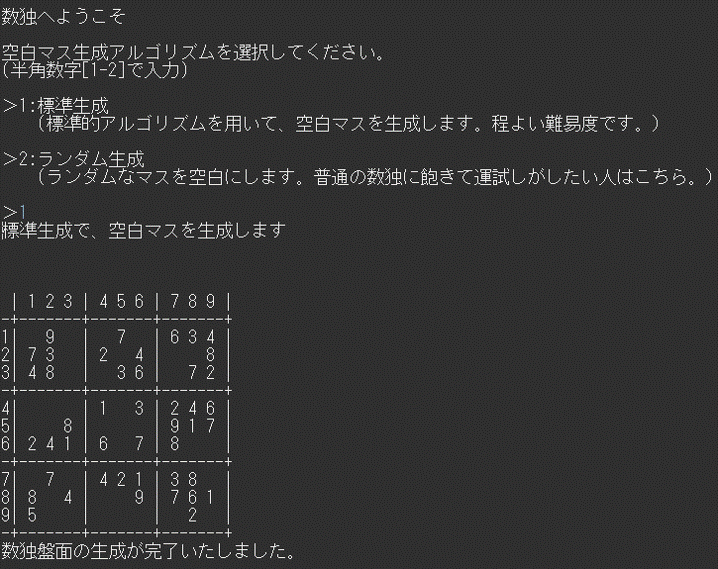
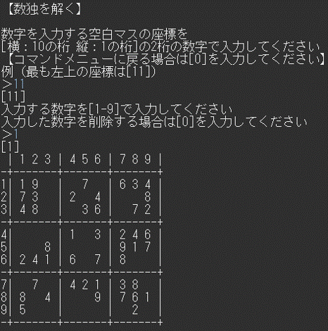
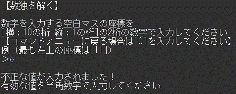
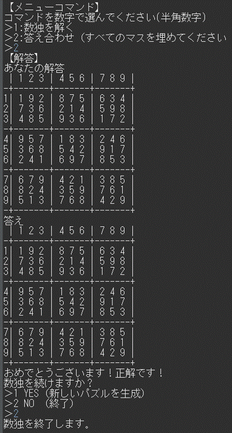

# 数独プログラム開発プロジェクト

## 1. プロジェクト概要
### Java（ver.21）で構築した、アルゴリズムと堅牢性を重視した数独（ナンプレ）生成・プレイシステムです。 
### 単に動くだけでなく、「解が必ず一つ（一意性）であることの保証」と、「ユーザーの誤操作で絶対に落ちないエラーハンドリング」にこだわって開発しました。

## 2. 使用技術
* 使用言語: Java (ver.21)
* ツール: Eclipse, PowerShell

【技術トピック】
* アルゴリズム: バックトラッキング（再帰探索）を用いた盤面生成と一意性チェック
* エラーハンドリング: try-catchによる例外処理と、多重バリデーション
* 設計: MVCモデルを意識したパッケージ構成（App/Logic/Model/UI）
* コレクション: Set（重複排除）、ArrayList（動的管理）

## 3. 実行済タスク

【コアエンジン】
* 9x9の盤面に矛盾なく数字を埋める基礎アルゴリズムの実装。
* 完成した盤面から数字を抜き、問題を作成する機能
* 生成されたパズルの解答が唯一性を確認するチェック機能。

【ゲーム機能】
* 2種類のパズル化アルゴリズムの実装(CandidatePuzzle , RandomPuzzle)
* パズル化アルゴリズムを選択できる機能を実装
* コンティニュー機能の実装。
* 全てのマスを埋めて、コマンドメニューから完全盤面と照合してクリア判定を行う答え合わせ機能を実装。
* 数独解答モード中の数字入力0による数字削除機能実装。

【UI/UX】
* 1〜9以外の数字や、座標範囲外（2桁以外など）の入力に対するエラー表示。
* 数字以外の文字が入力された際の例外処理機能。
* 初期盤面で数値の配置されていたマスにはアクセス出来ないようにする機能を実装。

【コーディング設計的改善】
* パッケージ、クラスの整理（進行中）
* 各クラスにjavadocコメントを記載（進行中）
* 命名規則の統一（アンダースコアの廃止、キャメルケースの採用）。
* 役割に応じたパッケージ分割（Model / Logic / UI / App の4層構造）。
* Scannerの共通化によるリソース管理の最適化。

## 4. スクリーンショット
　
　
　
　

## 5. 注力事項

【 堅牢なエラーハンドリング】
* 例外の徹底排除:Scanner利用時のInputMismatchExceptionによる強制終了を防ぐため、try-catchとバッファクリア（nextLine()）を組み合わせた入力受付を実装。
* 多重バリデーション: 「型チェック（数字か）」「範囲チェック（1-9か）」「座標チェック（有効な位置か）」「ルールチェック（初期盤面か）」の4段階の防波堤をErrorHandlerに集約。
* 役割の分離: 入力受付、検証、表示をクラス単位で分離し、どこに修正が必要になっても他への影響を最小限に抑える設計（単一責任の原則）を意識しました。

【 アルゴリズムの品質と論理的なパズル生成】
* 一意性の保証: バックトラッキングを用いた全探索アルゴリズムにより、解が必ず「唯一つ」になるパズルのみを出力する仕組みを構築。
* 戦略的な穴あけ: 単純なランダム消去に加え、周囲の候補数（Candidate）を計算して消去の可否を判断する「CandidatePuzzleロジック」を試作。

## 6. 今後の展望（ToDoリスト:優先度順）

* 0.可読性・保守性・拡張性等を重視した設計（恒常的に確認）
	* 各クラスにjavadocコメントを記載する。
	* コード内コメントの整理、および規則作りと徹底。

* A. ユーザー入力の強化（UI層）
	* 現状盤面の初期盤面で数値が配置されていたセルの数字を変えてユーザーが分かりやすくする。
		* →ANSI エスケープシーケンス使用予定
	* InputHandlerへの統合: 各入力クラスを一つにまとめ、管理しやすくする。

* B. ゲームプレイ機能の拡張
	* リアルタイム・ルールチェック: 数字を入力した瞬間に、縦・横・ブロックで重複がないか警告を出す機能。
	* Undo（やり直し）機能: 間違えて入力した際、一つ前の状態に戻せる機能（Stack構造の学習と実践）。

* C. GUIへの移行
	* Java SwingやJavaFXを用いたデスクトップアプリケーション化。

* D. アルゴリズムのブラッシュアップ
	* パズル化ロジックの高度化: 難易度に応じて、より効率的かつ確実にパズルを作成するアルゴリズムへの改良。
	* 「一意性の確認」の高速化: 探索効率を上げ、待ち時間を短縮する。
	* メモリ効率向上のためのバックトラッキングの最適化
	* RandomPuzzleアルゴリズムについて
		* →　パズル化ロジックを高度化することによって空白マスの最大数64個の実現を目指す
	* CandidatePuzzleアルゴリズムについて
		* →　現状のアルゴリズムでは同数字が消える確率が高く数独として偏っている可能性がある。
			* →　Candidata取得を層に分けて管理し、高度なCandidata取得アルゴリズムを作成し、空白マス数値の偏向およびCandidatePuzzleの難易度選択実装を目指す
				* →　空白化されているマスの数を出力するテストロジックの作成

## 7. Appendix: アイデアメモ（創作ノート）
###本プロジェクトの開発中に浮かんだ、数独を応用したゲーム案のメモです。
###実装予定ではなく、発想の記録として掲載しています。（公開用ファイルにつき、詳細については別途管理）

* 数独をモチーフにしたRPGゲーム
* 数独で三目並べを基にした陣取りゲーム
	* →　上記のRPGゲーム内のミニゲームとして実装してもいい。

## //履歴//

##[2026/01/26 - 01/31]
###「ここまでの実装内容まとめ」
* 全盤面生成ロジック: 9x9の盤面に矛盾なく数字を埋める基礎アルゴリズムの実装。
*  パズル化機能: 完成した盤面から数字を抜き、問題を作成する機能。
	* →（ただしアルゴリズムが簡易的なものなので、改良の余地あり
* 一意性確認アルゴリズム: 生成されたパズルが「答えが一つだけ」であるかを確認する高度なチェック機能。
	* 難易度選択の基礎: パズル化の際の難易度指定
		* →（パズル化機能アルゴリズムに依存するのでこちらも改良の余地あり）
* 設計の整理（進行中）:
* 命名規則の統一（アンダースコアの廃止、キャメルケースの採用）。
* 役割に応じたパッケージ分割（Model / Logic / UI / App の4層構造）。
* Scannerの共通化によるリソース管理の最適化。

###[2026/02/01]
* README追加
* コマンドメニューの導入
* アドレス入力からコマンドメニューに戻れるように実装
* 答え合わせ機能: 全てのマスが埋まった際、正解盤面と照合してクリア判定を行う。

###[2026/02/02]
* 数独各モードのコードをクラス化
* コンティニュー機能の実装
* アドレス入力受付について不正な値の入力エラー処理を実装
* SudokuSolver分の不正数値入力エラーチェックを導入

###[2026/02/03]
* 戻るコマンドの0が機能していないバグの修正
* Commandクラスを作成、入力によるモード選択をメソッド化
* すべての入力受付について不正な値の入力エラー処理を実装

###[2026/02/04]
* 指定の座標の候補数字をSetで返すCandidateFinderクラス追加
* ランダムな座標の数値を解答の一意性から消去するかどうか判断する、CandidatePuzzleアルゴリズム作成
* タイトルから完全盤面、パズル化盤面生成までの流れを整理
* アルゴリズムを選択出来る機能を実装（難易度機能を一時廃止、難易度選択画面をアルゴリズム選択画面に変更）

###[2026/02/05]
* ランダム生成アルゴリズムを選択した際にパズル盤面が生成されない不具合を修正
* ランダム生成アルゴリズムの空白マスの範囲を20-52に調整
* 一部UI調整
* パッケージ、クラス整理

###[2026/02/06]
* 数独解答モード中の数字入力0による数字削除機能実装。
* 初期盤面で数値の配置されていたマスにはアクセス出来ないようにする機能を実装。
* 実行ファイル（jar）のビルドおよび動作確認済

###[2026/02/12]
* READMEにスクリーンショット項目を追加
* appフォルダ内およびlogicフォルダ内の一部のクラスにjavadocコメントを記載

###[2026/02/13]
* logicフォルダの一部クラスにjavadocをコメント記載

###[2026/02/15]
* すべてのクラスにjavadocコメントを記載
